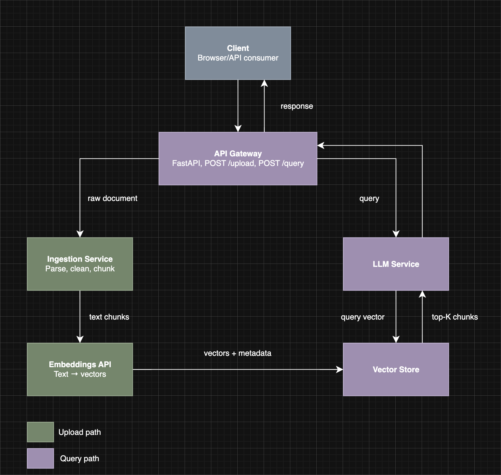

# NodeRAG Architecture

## Overview
- NodeRAG is a Retrieval-Augmented Generation (RAG) system that enables users to upload documents and query them through a conversational AI Interface. Rather than relying on an LL’s pre-trained knowledge, the system grounds every response strictly in the content of the uploaded documents.
- Incoming documents are parsed, cleaned, and split into chunks by the Ingestion Service, which then converts them into vector embeddings and stores them alongside their metadata in a Vector Store. At query time, the user’s question is similarly vectorised and used to retrieve the most semantically relevant chinks via cosine similarity search. Those chunks are injected into a structured prompt and passed to an LLM, which produces a response grounded entirely in the retrieved context.
- All client interactions flow through a single FastAPI-based API Gateway, which handles routing and validation across both the upload and query pipelines.


## Components
- **API Gateway:**
    - The single entry point for all client requests, whether that’s a document upload or a user query
    - Handle routing, authentication, and request validation before forwarding traffic to the appropriate internal service
    - Nothing reaches the backend w/o passing through it first
- **Ingestion Service:**
    - Responsible for receiving raw documents, parsing them into plain text, and splitting that text into overlapping chunks suitable for embedding
    - Handle all the messy pre-processing work: cleaning special characters, normalising whitespace, and producing a clean array of text chunks as output
    - Downstream services never touch raw files and only receive what the ingestion service has prepared
- **Vector Store:**
    - The database layer that persists vector embeddings alongside their metadata (filename, page number, chunk index)
    - Expose similarity search capabilities so that at query time, the system can efficiently retrieve the top-K chunks most semantically relevant to a user’s question
    - Everything ingested lives here until explicitly deleted
- **LLM Service:**
    - Wrap the language model and is responsible for taking a user query + the retrieved context chunks and producing a grounded natural-language answer
    - Enforce the strict prompting rules that prevent hallucination: if the answer isn’t in the provided context, it says no
    - The only component that generates text, whereas every other component moves or transforms data

## Data Flow Diagram


## Communication Schema
- **Upload request (Client → API Gateway → Ingestion Service):**
    ``` json
    {
        "filename": "report.pdf",
        "content_type": "application/pdf",
        "file": "<binary stream>"
    }
    ```
- **Ingestion Service → Vector Store (what gets stored per chunk):**
    ``` json
    {
        "vector": [0.012, -0.834, 0.201, "...1536 dims"],
        "metadata": {
            "doc_id": "uuid-1234",
            "filename": "report.pdf",
            "page_number": 3,
            "chunk_index": 7,
            "chunk_text": "The quarterly revenue increased by..."
        }
    }
    ```
- **Query request (Client → API Gateway → LLM Service):**
    ``` json
    {
        "query": "What was the revenue in Q3?",
        "top_k": 5,
        "filters": {
            "filename": "report.pdf"
        }
    }
    ```
- **LLM Service → Vector Store (similarity search call):**
    ``` json
    {
        "query_vector": [0.045, -0.712, 0.389, "...1536 dims"],
        "top_k": 5,
        "metadata_filter": {
            "filename": "report.pdf"
        }
    }
    ```
- **LLM Service → Client (final response):**
    ```json
    {
        "answer": "Revenue in Q3 was $4.2M, a 12% increase year on year."
        "sources": [
            {
                "filename": "report.pdf",
                "page_number": 3,
                "chunk_index": 7,
                "chunk_text": "The quarterly revenue increased by..."
            }
        ]
    }
    ```

## Key Design Decisions
- Schema between FastAPI and Vector DB finalised before coding begins
- Metatdata stored alongside vector to enable filtered retrieval
- LLM Service never receives raw documents - only pre-retrieved raw